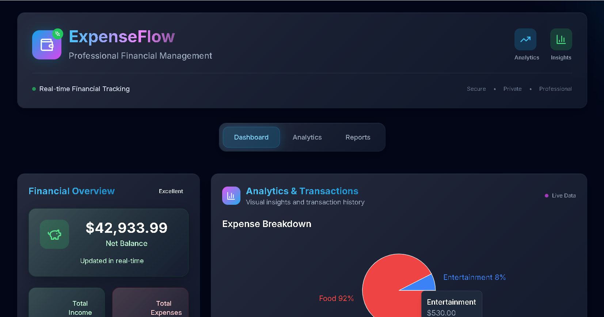
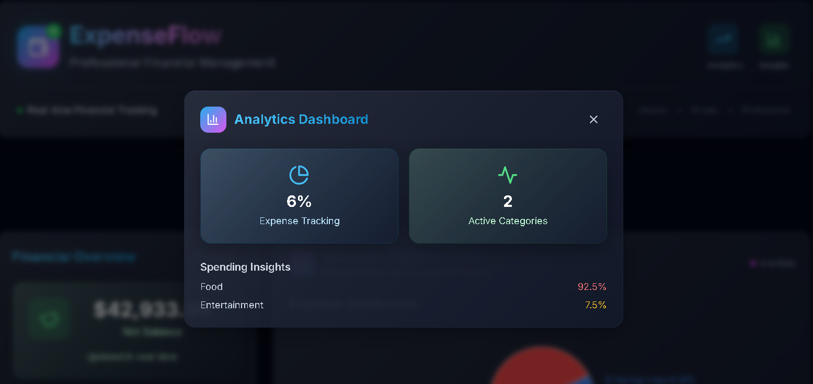
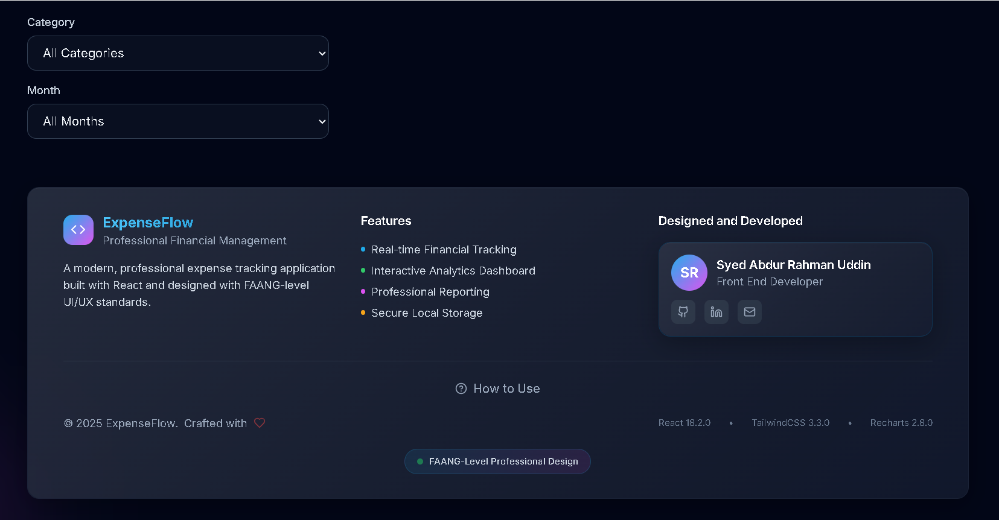

# Expense Flow - Tracker App

A responsive and minimal expense tracker application built with React, featuring a clean UI, dark mode support, and comprehensive transaction management. 

Live - 🔗 [ExpenseFlow](https://expensefflow.netlify.app/)


    

## ✨ Features

### Core Features
- **Add Transactions**: Add income or expense transactions with title, amount, category, and date
- **Balance Summary**: View total income, total expenses, and net balance
- **Data Visualization**: Interactive pie chart showing expense breakdown by category
- **Transaction Management**: Edit and delete existing transactions
- **Filtering**: Filter transactions by category and/or month
- **Local Storage**: All data is automatically saved to browser's localStorage
- **Responsive Design**: Works seamlessly on desktop and mobile devices

### Enhanced Features
- **Form Validation**: Comprehensive error handling and validation
- **Real-time Updates**: Charts and summaries update automatically
- **Modern UI**: Clean, intuitive interface with smooth animations
- **Accessibility**: Proper ARIA labels and keyboard navigation

## 🛠️ Tech Stack

- **React 18** - Modern React with functional components and hooks
- **Recharts** - Beautiful and responsive charts
- **Tailwind CSS** - Utility-first CSS framework
- **Lucide React** - Beautiful & consistent icon toolkit
- **LocalStorage** - Client-side data persistence

## 🚀 Getting Started

### Prerequisites
- Node.js (version 14 or higher)
- npm or yarn package manager

### Installation

1. **Clone or download the project files**

2. **Install dependencies**
   ```bash
   npm install
   ```

3. **Start the development server**
   ```bash
   npm start
   ```

4. **Open your browser**
   Navigate to `http://localhost:3000` to view the application

### Build for Production

```bash
npm run build
```

This creates an optimized production build in the `build` folder.

## 📱 Mobile App Deployment

### Progressive Web App (PWA)

This app is configured as a Progressive Web App, which means it can be installed on mobile devices like a native app!

#### How to Install on Mobile:

**Android (Chrome):**
1. Open the app in Chrome browser
2. Tap the menu (⋮) → "Add to Home screen"
3. Follow the prompts to install

**iOS (Safari):**
1. Open the app in Safari browser
2. Tap the share button (□↑) → "Add to Home Screen"
3. Follow the prompts to install

#### Deploy to Web Hosting:

To make your app available on mobile devices, deploy it to a web hosting service:

**Option 1: Netlify (Free)**
```bash
npm run build
# Drag the 'build' folder to netlify.com
```

**Option 2: Vercel (Free)**
```bash
npm install -g vercel
vercel
```

**Option 3: GitHub Pages**
```bash
npm install --save-dev gh-pages
# Add to package.json scripts:
# "predeploy": "npm run build",
# "deploy": "gh-pages -d build"
npm run deploy
```

### Native Mobile Apps

For true native mobile apps, consider these options:

**Option 1: React Native (Recommended)**
- Convert the app to React Native
- Maintains most of your existing React code
- Native performance and app store distribution

**Option 2: Capacitor**
- Wrap your existing React app in a native container
- Access to native device features
- Easy conversion from web to mobile

**Option 3: Expo**
- React Native development platform
- Easy deployment to app stores
- Built-in development tools

## 📱 Usage

### Adding Transactions
1. Select transaction type (Income or Expense)
2. Enter a title for the transaction
3. Input the amount (must be greater than 0)
4. Choose a category from the dropdown
5. Select a date (defaults to today)
6. Click "Add Transaction"

### Managing Transactions
- **Edit**: Click the edit icon (pencil) next to any transaction
- **Delete**: Click the delete icon (trash) to remove a transaction
- **Filter**: Use the filters panel to view transactions by category or month

### Viewing Analytics
- The pie chart automatically updates to show expense breakdown by category
- Hover over chart segments to see detailed information
- The balance summary shows real-time totals

### Dark Mode
- Click the sun/moon icon in the header to toggle between light and dark themes
- Your preference is automatically saved

## 🎨 Component Structure

```
App
├── Header (with dark mode toggle)
├── BalanceSummary (income, expenses, net balance)
├── AddTransactionForm (add new transactions)
├── Filters (category and month filters)
├── ExpenseChart (pie chart visualization)
└── TransactionList (display and manage transactions)
```

## 📊 Data Categories

### Expense Categories
- Food
- Transport
- Entertainment
- Shopping
- Healthcare
- Education
- Bills
- Travel
- Other

### Income Categories
- Salary
- Freelance
- Investment
- Gift
- Other

## 🔧 Customization

### Adding New Categories
Edit the `CATEGORIES` and `INCOME_CATEGORIES` arrays in `src/App.js`:

```javascript
const CATEGORIES = [
  'Food', 'Transport', 'Entertainment', 'Shopping', 
  'Healthcare', 'Education', 'Bills', 'Travel', 'Other',
  'Your New Category' // Add here
];
```

### Styling
The app uses Tailwind CSS for styling. You can customize:
- Colors in `tailwind.config.js`
- Component styles in `src/index.css`
- Individual component styling

## 📱 Responsive Design

The application is fully responsive and optimized for:
- **Desktop**: Full layout with sidebar and main content
- **Tablet**: Adaptive grid layout
- **Mobile**: Stacked layout with touch-friendly controls

## 🔒 Data Privacy

- All data is stored locally in your browser's localStorage
- No data is sent to external servers
- Your financial information stays private and secure

## 🐛 Troubleshooting

### Common Issues

**App won't start:**
- Ensure Node.js version 14+ is installed
- Delete `node_modules` and run `npm install` again

**Charts not displaying:**
- Check browser console for errors
- Ensure Recharts is properly installed

**Data not persisting:**
- Check if localStorage is enabled in your browser
- Clear browser cache and try again

## 🤝 Contributing

Feel free to contribute to this project by:
- Reporting bugs
- Suggesting new features
- Submitting pull requests
- Improving documentation

## 📄 License

This project is open source and available under the [MIT License](LICENSE).

## 🙏 Acknowledgments

- Built with React and modern web technologies
- Icons provided by Lucide React
- Charts powered by Recharts
- Styled with Tailwind CSS

---

**Happy Expense Tracking! 💰** 
